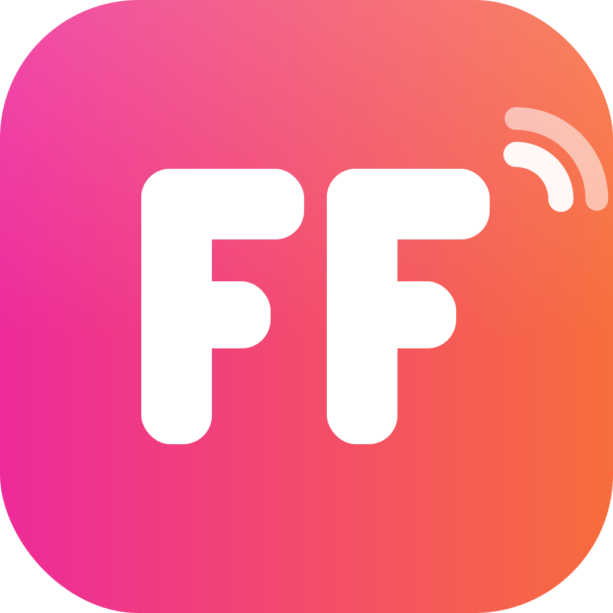

<p align="center">
  
</p>

# Flurfunk

**Dein Team. Dein Server. Deine Daten.**

[](https://github.com/maxischmaxi/flurfunk/releases/latest)
[](LICENSE)
[](https://github.com/maxischmaxi/flurfunk/actions/workflows/release.yml)

Flurfunk ist ein Team-Chat mit Voice-Calls, den du komplett selbst
hostest — eine schlanke Slack-Alternative ohne Cloud, ohne Abo und ohne
Datenweitergabe. Der Server läuft auf deiner Hardware, sämtliche
Nachrichten liegen dort verschlüsselt. Client und Server sind native
Programme (kein Browser, kein Electron): Sie starten sofort, brauchen
wenig Speicher und fühlen sich auch bei großen Verläufen flüssig an.

<!-- TODO: Screenshot einfügen: docs/screenshot.png -->

## Warum Flurfunk?

- **Selbst gehostet** — ein Binary starten, fertig. Deine Daten verlassen
  nie deinen Server.
- **Verschlüsselt** — Transport über das Noise-Protokoll (wie moderne
  Messenger), Nachrichten auf der Platte einzeln verschlüsselt, Voice-
  Pakete einzeln verschlüsselt über UDP. [Details](docs/DEVELOPMENT.md#sicherheitsmodell)
- **Voice-Calls, die gut klingen** — Opus-Audio mit Rauschunterdrückung
  (RNNoise), Echo-Cancellation und Sprach-Gate: Tastatur und Lüfter
  bleiben draußen. Bei Stille fließt praktisch kein Byte.
- **Mehrere Server gleichzeitig** — wie Workspaces in Slack, nur dass
  jeder „Workspace" ein eigener Server sein kann.
- **Schnell und leichtgewichtig** — natives UI mit flüssigen Animationen,
  hellem und dunklem Theme (folgt dem System) und UI-Zoom.

## Features

- **Channels und Direktnachrichten** — Channels sind invite-only,
  Umlaute im Namen erlaubt (`#büro-küche`).
- **Voice-Calls in jedem Channel und jeder DM** — mit Teilnehmer-Leiste,
  Speaking-Anzeige, Mute, ausgliederbarem Mini-Fenster und Call-Verlauf
  als Chat-Nachricht (wer, wann, wie lange).
- **Nachrichten bearbeiten** — mit Verlauf („History anzeigen") und
  „(bearbeitet)"-Badge.
- **Rich Text und Code** — `*fett*`, `_kursiv_`, `` `code` `` und
  Code-Blöcke mit Syntax-Highlighting für über 25 Sprachen, inklusive
  Copy-Button.
- **Audio-Einstellungen mit Selbsttest** — Mikrofon und Lautsprecher
  wählen, sich selbst probehören (auch mitten im Call, ohne dass andere
  den Test hören) und Rauschunterdrückung, Echo-Cancellation und
  Sprach-Gate einzeln schalten.
- **Alles Erwartbare** — Ungelesen-Badges, Online-Presence,
  „Neu"-Trennlinie, Schnellsuche (`Strg+K`), Latenz-Anzeige,
  Auto-Reconnect, Text markieren und kopieren wie im Browser.

## Installation

### macOS (Apple Silicon)

```sh
brew install maxischmaxi/tap/flurfunk
```

Alternativ: `Flurfunk-<version>-macos-arm64.app.zip` von den
[Releases](https://github.com/maxischmaxi/flurfunk/releases/latest) laden,
entpacken und `Flurfunk.app` in den Programme-Ordner ziehen. Solange die
Builds nicht notarisiert sind, beim ersten Start: Rechtsklick → „Öffnen".

### Arch Linux

```sh
yay -S flurfunk-bin        # oder: paru -S flurfunk-bin
```

### Andere Linux-Distributionen

Tarball von den [Releases](https://github.com/maxischmaxi/flurfunk/releases/latest)
laden und entpacken — die Binaries brauchen nur glibc und X11, alle
Audio-Bibliotheken sind bereits enthalten:

```sh
tar xf flurfunk-<version>-linux-x86_64.tar.gz
./flurfunk-<version>-linux-x86_64/flurfunk
```

Alle Downloads lassen sich gegen die `SHA256SUMS.txt` des Releases prüfen.

## Server aufsetzen

Der Server ist ein einzelnes Binary — kein Docker, keine Datenbank:

```sh
flurfunk-server -port 7788 -data ./flurfunk-data
```

Beim ersten Start erzeugt er seine Schlüssel selbst. Wer sich als
**erste Person** verbindet, wird automatisch **Administrator** und richtet
den Server ein (Servername). Danach lädt man sein Team ein — Clients
verbinden sich einfach mit `host:port` (TCP **und** UDP auf dem Port
freigeben; UDP trägt die Voice-Calls).

Der Master-Schlüssel (`master.key`) lässt sich per `-key` auf ein
separates Medium legen — dann sind Daten und Schlüssel physisch getrennt.
Alle Flags: [docs/DEVELOPMENT.md](docs/DEVELOPMENT.md#server-flags).

## Erste Schritte im Client

1. `flurfunk` starten und `host:port` des Servers eingeben.
2. Benutzernamen und Passwort wählen — fertig.
3. Weitere Server kommen über das `+` in der linken Server-Leiste dazu.

Die Client-Konfiguration (Server, Sitzungen, Theme, Zoom) liegt unter
`~/.config/flurfunk/client.json`.

### Shortcuts

| Shortcut | Wirkung |
|----------|---------|
| `Strg+K` | Schnellsuche: zu Kanal oder Person springen |
| `Alt+↑ / Alt+↓` | vorheriger / nächster Kanal |
| `Strg+1…9` | Server wechseln |
| `Enter` / `Shift+Enter` | senden / neue Zeile |
| `Strg` `+` / `−` / `0` | UI vergrößern / verkleinern / zurücksetzen |
| `Tab` / `Shift+Tab` | Tastatur-Navigation (in Code-Blöcken: einrücken) |
| `Esc` | Modal schließen, sonst ans Chat-Ende springen |
| `Bild↑ / Bild↓` | im Verlauf blättern |

Der Kopfhörer-Button im Kanal-Header startet einen Voice-Call, das
Zahnrad unten links öffnet die Einstellungen, das Sonne/Mond-Icon oben
rechts schaltet das Theme.

## Sicherheit in Kürze

Kein Klartext übers Netz (Noise `XX` mit Key-Pinning wie bei SSH), keine
Klartext-Nachrichten auf der Platte (XChaCha20-Poly1305 pro Channel-Key,
gewrappt unter einem Master-Key), Passwörter mit Argon2id. Voice läuft
als einzeln verschlüsselte UDP-Pakete über eine SFU, die Inhalte nur
weiterleitet und nichts davon speichert. Ausführlich:
[Sicherheitsmodell](docs/DEVELOPMENT.md#sicherheitsmodell).

## Entwicklung

Flurfunk ist komplett in [Odin](https://odin-lang.org) geschrieben
(raylib-UI, miniaudio). Bauen, Tests, Repo-Aufbau und Release-Prozess:
[docs/DEVELOPMENT.md](docs/DEVELOPMENT.md).

## Lizenz

[MIT](LICENSE) — © 2026 Max Jeschek
